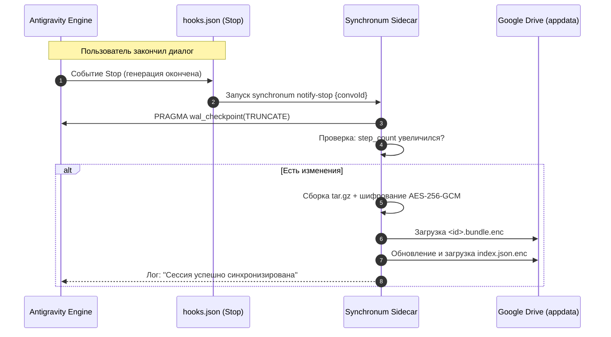

# Техническое задание (ТЗ)
## Проект: «Synchronum» — Open-Source синхронизация сессий Google Antigravity 2.0

---

### 1. Введение и цель проекта

#### 1.1. Назначение системы
**Synchronum** — это расширение (Sidecar) и утилита командной строки для Google Antigravity 2.0, обеспечивающая надежную, автоматическую и безопасную синхронизацию контекста сессий, истории рассуждений агента и сгенерированных артефактов между рабочими станциями (например, стационарный ПК и ноутбук).

#### 1.2. Ключевые требования к продукту
* **Zero-Server / Zero-Cost**: Отсутствие необходимости разворачивать собственные сервера, платить за хостинг или базы данных.
* **Использование нативной инфраструктуры**: Хранение зашифрованных состояний в скрытой системной папке Google Диска (`appDataFolder`) пользователя Antigravity Pro (квота 2–5+ ТБ).
* **Сквозное шифрование (Zero-Knowledge E2EE)**: Google Диск выступает только как хранилище шифротекста (AES-256-GCM). Исходный код проектов, системные промпты и мысли агента не покидают устройства в открытом виде.
* **Кроссплатформенная трансляция путей (Path Translation)**: Бесшовное переключение между операционными системами (Windows, macOS, Linux) без потери привязки диалогов к рабочим директориям.
* **Нативный UX**: Интеграция в интерфейс Antigravity через Auxiliary Pane и жизненные циклы через `hooks.json`.

---

### 2. Анализ данных и источники синхронизации Antigravity 2.0

| Источник данных | Локальный путь | Тип и формат | Критичность для синхронизации |
| :--- | :--- | :--- | :--- |
| **Реестр сессий** | `~/.gemini/antigravity/conversation_summaries.db` | SQLite (WAL) | **Критично**: Список диалогов, метаданные, статус, проект, protobuf blob |
| **Тело сессии** | `~/.gemini/antigravity/conversations/<id>.db` | SQLite (WAL) | **Критично**: Таблица `steps` (история запросов, вызовы тулов, вывод) |
| **Контекст Brain** | `~/.gemini/antigravity/brain/<id>/` | Директория (FS) | **Критично**: `transcript.jsonl`, артефакты планов, логи выполнения |
| **UI State** | `%APPDATA%/Antigravity/app_storage.json` | JSON | *Опционально*: Открытые вкладки, ширина панелей |

---

### 3. Архитектура системы

```mermaid
flowchart TB
    subgraph AntigravityApp["Google Antigravity 2.0"]
        direction TB
        AG_Engine["Agent Engine & SQLite DBs"]
        Hooks["hooks.json (Stop Event)"]
        AuxPane["Auxiliary Pane UI (Iframe)"]
    end

    subgraph Synchronum["Synchronum Sidecar Daemon"]
        direction TB
        HookListener["Hook / Event Listener"]
        Engine["Sync Engine & Conflict Resolver"]
        Crypto["E2EE (Argon2id + AES-256-GCM)"]
        PathEngine["Path Translation Engine"]
        OAuth["Google OAuth 2.0 (PKCE Loopback)"]
    end

    subgraph Cloud["Google Cloud / User Storage"]
        GDrive["Google Drive (appDataFolder)"]
    end

    Hooks -->|IPC / CLI Call| HookListener
    AuxPane <-->|Local Web API| Synchronum
    AG_Engine <-->|WAL Checkpoint & SQLite Read/Write| Engine
    Engine --> Crypto
    Engine --> PathEngine
    Crypto --> OAuth
    OAuth <-->|REST API (appdata)| GDrive
```

#### 3.1. Основные программные модули:
1. **`synchronum-core` (Движок синхронизации)**:
   - Контроль SQLite: безопасное чтение/запись, вызов `PRAGMA wal_checkpoint(TRUNCATE)`.
   - Bundler: сборка бандла сессии (`conversation.db` + метаданные `meta.json` + директория `brain/<id>/`).
   - Importer: бесконфликтный `UPSERT` сессий в локальный `conversation_summaries.db`.
2. **`synchronum-crypto` (Модуль шифрования)**:
   - Деривация ключа через Argon2id (`key_length: 32`, `memory: 64MB`, `iterations: 3`).
   - Симметричное шифрование пакетов: AES-256-GCM с уникальным IV (12 байт) и проверкой тега аутентификации (16 байт).
3. **`synchronum-path` (Модуль трансляции путей)**:
   - Извлечение Git Remote URL целевого проекта.
   - Маппинг абсолютных корней рабочих пространств (Windows ↔ POSIX).
4. **`synchronum-gdrive` (Google Drive Client)**:
   - Авторизация через OAuth 2.0 Desktop PKCE с локальным сервером редиректа (`127.0.0.1:42124`).
   - Хранение токенов в системном хранилище ключей ОС (Windows Credential Manager / macOS Keychain / Secret Service).
   - CRUD операции в `appDataFolder` через Google Drive v3 REST API.
5. **`synchronum-sidecar` & `synchronum-ui`**:
   - Нативный процесс Sidecar, поднимающий локальный сервер на `ANTIGRAVITY_SIDECAR_WEB_PORT`.
   - Интерфейс для Auxiliary Pane (`sidecar.json`), написанный на React/Tailwind.

---

### 4. Спецификация структур данных и протокола

#### 4.1. Бандл сессии (`<conversation_id>.bundle.enc`)
Каждая сессия архивируется в тарбол `tar.gz`, шифруется и передается как неделимый блок:
```text
session_bundle (внутри архива до шифрования):
├── meta.json               # Данные для conversation_summaries
├── conversation.db         # Дамп SQLite базы после сброса WAL
├── git_context.json        # Git remote, ветка, хэш коммита
├── uncommitted_diff.patch  # (Опционально) diff незакоммиченных изменений
└── brain/                  # Файлы артефактов и логов
    ├── implementation_plan.md
    └── .system_generated/
        └── logs/transcript.jsonl
```

#### 4.2. Метаданные `meta.json`
```json
{
  "conversation_id": "3c083c24-03f9-432d-a667-f02b7258c6eb",
  "title": "Синхронизация диалогов Antigravity",
  "step_count": 28,
  "last_modified_time": "2026-10-09T10:41:27.000Z",
  "status": "COMPLETED",
  "project_id": "f46b99cf-77ba-43df-9630-8837e44b769b",
  "workspace_rel_path": "Desktop/synchronum",
  "git_remote": "git@github.com:user/synchronum.git",
  "author_device": "pc-windows-workstation",
  "bundle_version": 4
}
```

#### 4.3. Облачный реестр `index.json.enc`
Файл в `appDataFolder` Google Диска, хранящий легкую таблицу состояний всех известных сессий:
```json
{
  "schema_version": 1,
  "updated_at": "2026-10-09T11:00:00Z",
  "last_device_id": "pc-windows-workstation",
  "sessions": {
    "3c083c24-03f9-432d-a667-f02b7258c6eb": {
      "bundle_file_id": "gdrive_file_id_98234",
      "bundle_sha256": "ab45c...",
      "last_modified_time": "2026-10-09T10:41:27.000Z",
      "step_count": 28,
      "size_bytes": 142058
    }
  }
}
```

---

### 5. Алгоритмы синхронизации и разрешение коллизий



#### 5.1. Алгоритм получения обновлений (Pull Workflow)
1. Каждые $N$ минут (по умолчанию 3 мин) или при фокусировке окна Antigravity сайдкар запрашивает метаданные файла `index.json.enc` (ETag / `modifiedTime`).
2. Если в облаке есть свежая версия:
   - Скачивает и расшифровывает `index.json`.
   - Находит сессии, где облачный `last_modified_time` > локального (или которых нет в локальной базе).
   - Загружает соответствующие бандлы.
   - Расшифровывает и распаковывает в безопасный временный каталог.
   - Выполняет трансляцию путей воркспейсов.
   - Переносит `brain/<id>/` и `<id>.db` в системные папки `~/.gemini/antigravity/`.
   - Выполняет `UPSERT` в локальный `conversation_summaries.db`:
     ```sql
     INSERT INTO conversation_summaries (conversation_id, title, preview, step_count, last_modified_time, workspace_uris, status, project_id, app_data_dir)
     VALUES (?, ?, ?, ?, ?, ?, ?, ?, ?)
     ON CONFLICT(conversation_id) DO UPDATE SET
       step_count = excluded.step_count,
       last_modified_time = excluded.last_modified_time,
       status = excluded.status;
     ```

#### 5.2. Разрешение конфликтов (Split-Brain)
Если одна сессия была независимо продолжена на ПК и ноутбуке в офлайн-режиме:
* **Стратегия:** Автоматический Fork (ответвление).
* **Реализация:** При обнаружении коллизии (разные шаги при общем родителе) сайдкар **не перезаписывает** локальную сессию. Он импортирует конфликтующую сессию под новым UUID с постфиксом в заголовке: `[Fork Ноутбук] Название сессии`.
* Таким образом, ни одна строка кода и ни один ответ модели не теряются.

---

### 6. Спецификация движка трансляции путей (Path Translation)

При импорте сессии на целевом устройстве алгоритм разрешает путь к воркспейсу по цепочке:

1. **Правило 1: Git Remote Match (Наивысший приоритет)**
   - Проверяется поле `git_remote` из `meta.json`.
   - Сканируется список проектов Antigravity в локальной базе.
   - Если в локальной системе найден проект с совпадающим remote URL, путь автоматически привязывается к нему.
2. **Правило 2: Root Path Remapping**
   - Проверяется таблица соответствия в конфигурации:
     ```yaml
     path_mappings:
       "C:\\Users\\Кирилл\\Desktop": "/Users/kirill/Desktop"
     ```
   - Заменяется базовый префикс, сохраняя относительный путь к подпапкам проекта.
3. **Правило 3: UI-промпт (Fallback)**
   - Если папка проекта физически не существует на данном устройстве, статус сессии помечается как `WORKSPACE_UNBOUND`.
   - В UI выводится кнопка: `Указать локальную папку проекта`.

---

### 7. Пользовательский интерфейс (Auxiliary Pane Extension)

Вкладка `Synchronum` в правой вспомогательной панели Antigravity предоставляет:

* **Мастер первого запуска (Onboarding Wizard)**:
  1. Кнопка «Войти через Google» (OAuth Loopback).
  2. Поле ввода Master Password с подтверждением.
  3. Тестовая проверка подключения к `appDataFolder`.
* **Основной экран мониторинга**:
  - Статус: `Подключено к Google Drive 🟢`.
  - Дисковая квота: отображение прогресс-бара занятого места.
  - Последние события: таблица синхронизированных сессий с бейджами устройств.
  - Ручные триггеры: `[Синхронизировать сейчас]`, `[Сделать резервную копию]`.
* **Экран сопоставления путей (Settings)**:
  - Визуальная таблица префиксов директорий между ОС.

---

### 8. Стек технологий и структура репозитория

#### 8.1. Выбор технологий
* **Язык Core/Sidecar**: **TypeScript (Node.js)** или **Go**. 
  * *Рекомендация: TypeScript / Node.js* — обеспечивает нативную интеграцию с `sidecar_sdk` Antigravity, прямое встраивание в Electron-окружение и отсутствие внешних рантайм-зависимостей.
* **База данных / FS**: `better-sqlite3` (синхронная быстрая работа с WAL-базами Antigravity).
* **Криптография**: `@noble/ciphers` (AES-GCM), `@noble/hashes` (Argon2id).
* **Фронтенд Sidecar UI**: React, Tailwind CSS, Lucide Icons.
* **Транспорт**: `@googleapis/drive` (Google Drive API v3).

#### 8.2. Структура проекта
```text
synchronum/
├── packages/
│   ├── core/                    # Ядро: sqlite, tar, crypto, path mapping
│   │   ├── src/
│   │   │   ├── bundler.ts
│   │   │   ├── crypto.ts
│   │   │   ├── sqlite.ts
│   │   │   └── path-resolver.ts
│   │   └── package.json
│   ├── gdrive-client/           # Модуль авторизации и работы с Google Drive
│   │   └── src/
│   │       ├── oauth.ts
│   │       └── drive-api.ts
│   └── sidecar/                 # Процесс Antigravity Sidecar + UI
│       ├── sidecar.json         # Манифест Antigravity Sidecar
│       ├── src/
│       │   ├── server.ts        # Сервер sidecar (SidecarApp)
│       │   └── ui/              # React фронтенд для Aux Pane
│       └── hooks.json           # Определение системных хуков Antigravity
├── README.md
├── LICENSE                      # MIT / Apache 2.0
└── package.json                 # Monorepo (pnpm / turbo)
```

---

### 9. План реализации (Roadmap)

| Этап | Задачи | Результат |
| :--- | :--- | :--- |
| **Этап 1: Core CLI (MVP)** | • Разбор баз SQLite Antigravity<br>• Экспорт и импорт бандла одной сессии в архив<br>• Вызов `wal_checkpoint` | Рабочий локальный CLI: `sync export <id>` и `sync import <bundle>` |
| **Этап 2: Криптография & GDrive** | • Интеграция Argon2id + AES-256-GCM<br>• Реализация OAuth 2.0 Loopback Flow<br>• CRUD бандлов в `appDataFolder` | Консольная синхронизация с Google Дисском |
| **Этап 3: Path Engine & Conflicts** | • Модуль распознавания Git Remote<br>• Алгоритм автоматического Fork при коллизиях<br>• Подмена `workspace_uris` | Кроссплатформенный перенос (Windows ↔ Mac) |
| **Этап 4: Sidecar & Antigravity UI** | • Оформление в качестве нативного Antigravity Sidecar<br>• Верстка UI во вспомогательной панели (Aux Pane)<br>• Интеграция `hooks.json` на событие `Stop` | Полноценное расширение, работающее прямо в Antigravity |
| **Этап 5: Open Source & Документация** | • Документация по установке в 1 команду<br>• GitHub CI/CD, релиз бинарников | Публичный релиз на GitHub |
